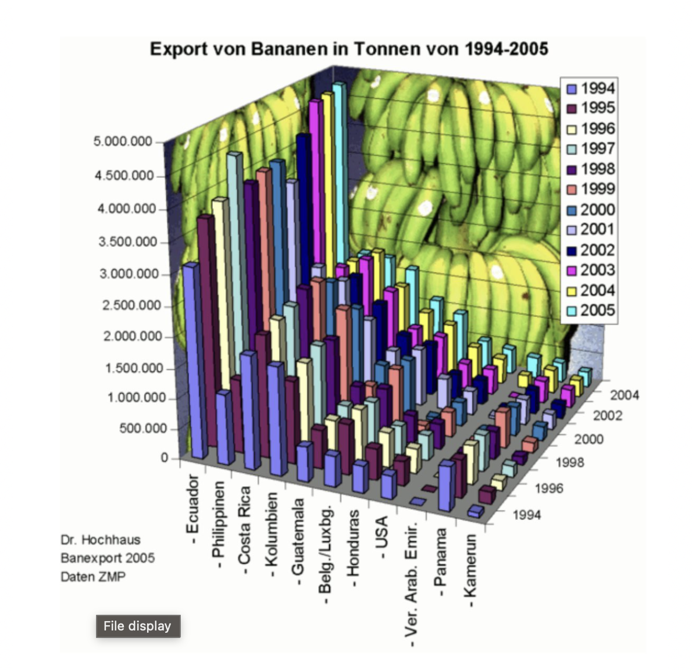
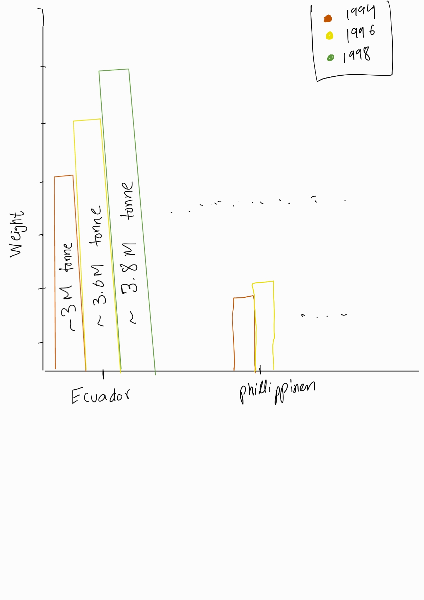
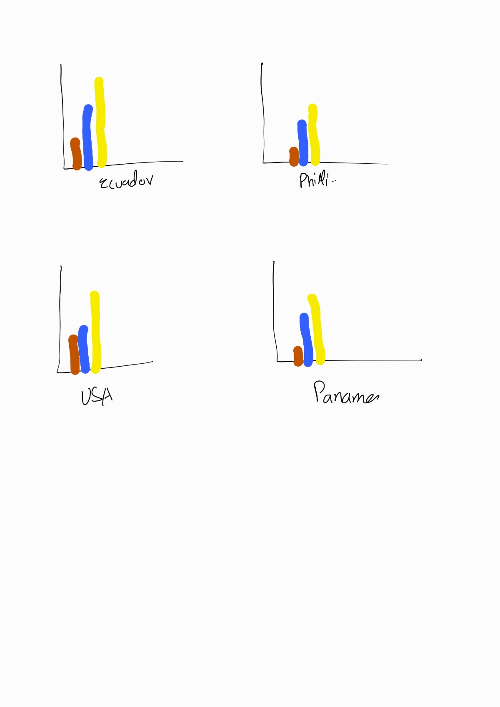
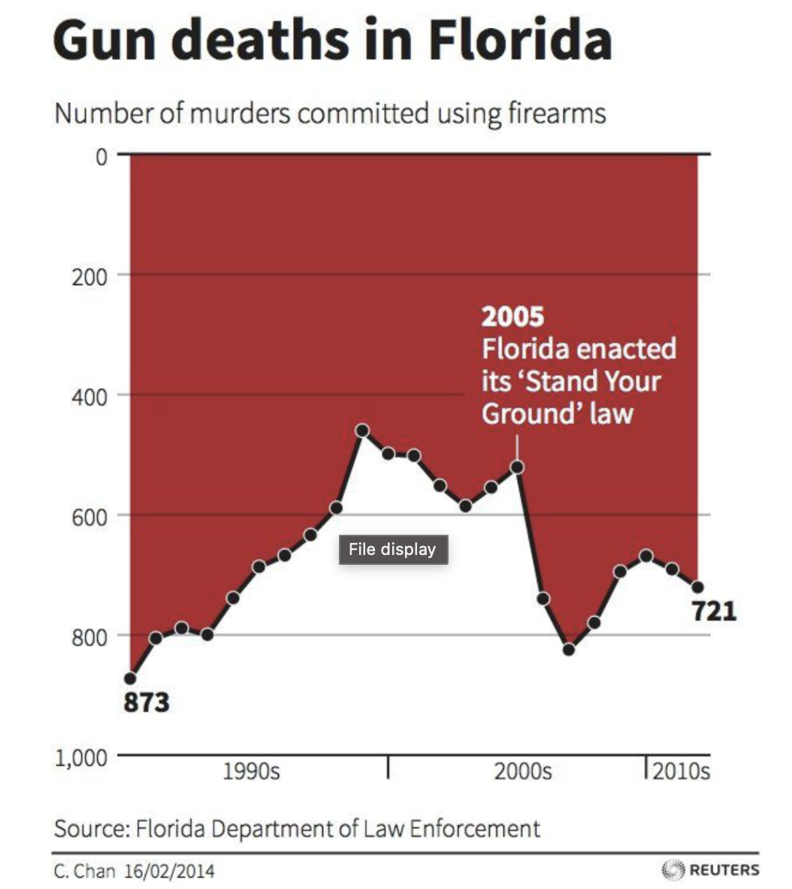
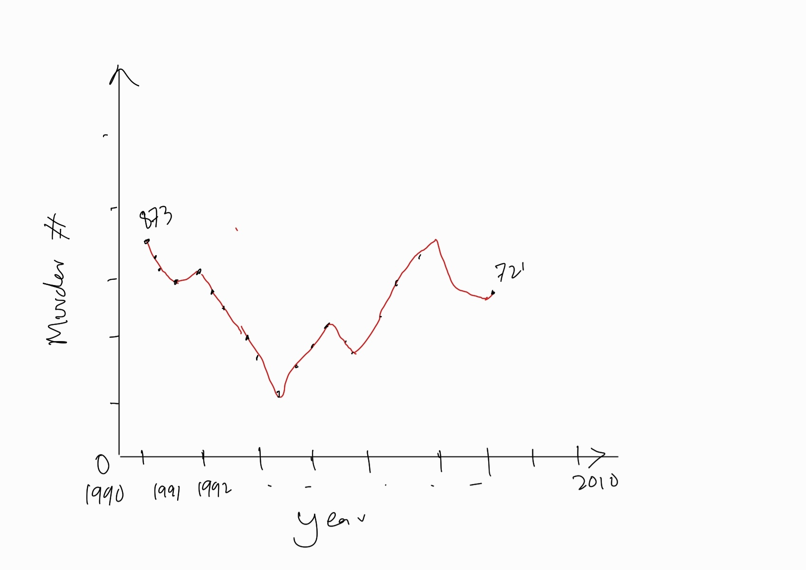
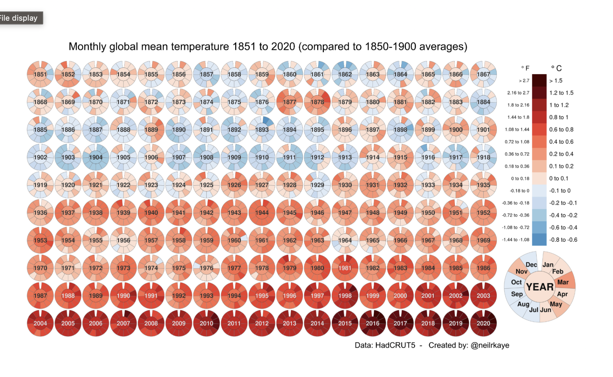

### Image 1

#### Issues:
1. The picture of banana is to distraction and fullfills not any significant purpose. its waste on ink.
2. cant see the bar plots behind other bars
3. at this angle the country to country comparison will not be accurate
4. There is no need to the legend for years as we already have the years on axis.
5. There is to much information, graph exactly is not depecting the goal of this visualization.

#### Better Approch:
Let say we can to show the per year growth of banana export each country wise
1. Have no picture of bananas in background,mentioning in title is enough.
2. Have side by side bar plots and color them with year can be a better approach to present similar information.
3. having ideally 2 axis to avoid the angle issue. no 3 axis
4. we can have a single horizontally long plot showing every country all years export OR we can have separate graphs for each country as subplots

idea is shown below
   

### Image 2

#### Issues
1. The y axis scale is reversed, covering more area hence creating wrong and opposite narrative. i.e its showing murders increased with years but looking at the numbers murder decreased.
3. Red color is mostly associate with danger, bad , blood hence using red specifically is helping present wrong narrative strongly
4. Time scale is to wage , we dont know what point is mappign on which year.

#### Improvments
1.  Have normal y scale i.e.0 at bottom and max value at the top
2.  here Red color is too intense but can be used. better in my prespective it to use red line instead.
3.  have proper years scale

Here is my graph showing same plot

### Image 3

#### Issues:
1. Too much information but overall good vizualization of the 'goal' i.e overall temperature is rising with years
2. I think the scale it too harch, the max difference is 1.5 degree but colors are makign it look like 10s of degrees.
3. per month information is not easily comparable between years
   
